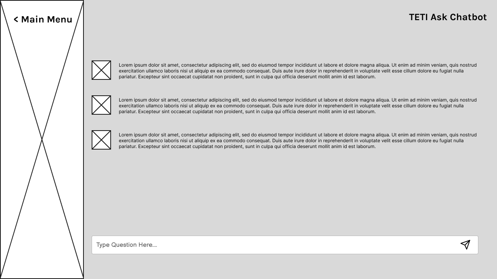

# **TETI Ask - Senior Project DTETI**

## **Kelompok Numero Uno**

**Ketua Kelompok:** Agustinus Angelo Christian Fernando - 21/473804/TK/52235

**Anggota 1:** Agustinus Angelo Christian Fernando - 21/473804/TK/52235

**Anggota 2:** Axel Xaverius Tamtama - 21/479414/TK/52892

**Anggota 3:** Nikolas Galih Saputro Anugrah Utomo - 21/482747/TK/53361

# **Modul 1**

**Instansi:** DTETI FT UGM Yogyakarta

## **Nama dan Jenis Produk**
**Nama Produk:** TETI Ask 

**Jenis produk:** Web Based Chatbot

## **Latar Belakang & Permasalahan** 

Mahasiswa masih seringkali bingung mengenai di mana harus mengakses suatu informasi terkait perkuliahan di DTETI. Sumber informasi yang tersedia pun masih terpisah-pisah. Bingungnya mencari suatu informasi tentunya menyebabkan waktu terbuang sia-sia sehingga menjadi hal yang tidak efektif.

Oleh karena itu, kami ingin membuat suatu web app yang menerapkan chatbot agar mahasiswa bisa bertanya suatu hal tentang TETI menggunakan bahasa sehari-hari dengan sangat mudah dan cepat untuk mendapatkan jawabannya. Hal ini tentunya dapat menghemat waktu mahasiswa dalam mencari suatu informasi yang dibutuhkan.

## **Rumusan Permasalahan**
- Bagaimana mahasiswa bisa mendapatkan informasi seputar DTETI dengan cepat dan sesuai kebutuhan?

- Bagaimana mahasiswa dapat mengakses informasi seputar DTETI di mana pun tanpa ada harus menginstall software tertentu?

- Bagaimana mahasiswa bisa mendapatkan informasi seputar DTETI kapan pun di luar jam kerja?

## **Penjelasan Solusi Produk**
TETI Ask adalah chatbot yang dapat menjawab semua pertanyaan Anda terkait DTETI FT UGM. 

Mahasiswa bisa bertanya apapun tentang DTETI menggunakan bahasa sehari-hari dengan sangat mudah dan cepat untuk mendapatkan jawabannya. Selain chatbot, kita juga akan membuat web yang berisi FAQ, dokumen, dan hal-hal penting terkait DTETI. Hal ini tentunya dapat menghemat waktu mahasiswa dalam mencari suatu informasi yang dibutuhkan.

TETI Ask berwujud web berbasis chatbot. Model AI Chatbot akan memanfaatkan cloud, yaitu Azure OpenAI. Jaringan komputer akan dimanfaatkan ketika melakukan deploy web app ini.

## **Fitur**
- **Chatbot:** Dapat menjawab semua pertanyaan pengguna yang berkaitan dengan informasi seputar DTETI FT UGM secara akurat dan cepat.
- **FAQ DTETI:** Berisikan hal-hal seputar DTETI yang paling sering ditanyakan oleh mahasiswa.
- **Histori pertanyaan:** Mahasiswa dapat mengakses chat yang sebelumnya pernah user lakukan dengan chatbot ini.
- **Dokumen Penting:** Berisikan daftar dokumen-dokumen penting yang dibutuhkan oleh mahasiswa DTETI.

## **Analisis Kompetitor**
### **Kompetitor 1: AILABOT**

| **Nama Kompetitor** | AILABOT |
| --- | --- |
| **Jenis Kompetitor** | Direct |
| **Jenis Produk** | Aplikasi Chatbot |
| **Target Customer** | Mahasiswa UNILAK |

 

| **Kelebihan** | **Kekurangan** |
| --- | --- |
| Berisi informasi yang lengkap terkait kampus, mulai dari alamat hingga bagaimana cara mendaftar di kampus tersebut. | Memerlukan sumber daya hardware yang mumpuni karena berjalan di local |
| Dapat memberikan akses yang cepat untuk mahasiswa mendapatkan informasi terkait kampus | Masih berjalan local sehingga diperlukan proses instalasi |

 

| **Key Competitive Advantage & Unique Value** |
| --- |
| Kunci kompetisi dari projek kami adalah berbasis web sehingga pengguna bisa memiliki kelonggaran dalam memilih gawai yang digunakan untuk mengakses projek kami tanpa harus takut adanya hambatan sumber daya hardware dan tidak perlu repot untuk menginstall aplikasi tambahan. |

### **Kompetitor 2: Chatbot Lintang UGM**

| **Nama Kompetitor** | Chatbot Lintang UGM |
| --- | --- |
| **Jenis Kompetitor** | Tertiary Competitors |
| **Jenis Produk** | Web App |
| **Target Customer** | Mahasiswa UGM |

 

| **Kelebihan** | **Kekurangan** |
| --- | --- |
| Ada emoji sehingga lebih interaktif | Masih belum akurat |
| Cukup simpel | Jawaban kadang tidak sesuai dengan pertanyaan |
| Sudah terbilang intuitif | UI masih kurang bagus |

 

| **Key Competitive Advantage & Unique Value** |
| --- |
| Chatbot yang kita buat bisa lebih akurat karena menggunakan layanan cloud Azure OpenAI yang sudah dilatih sedemikian rupa oleh Microsoft. |
| Design UI yang kita buat bisa lebih modern dan intuitif sehingga lebih nyaman digunakan oleh pengguna. |

### **Kompetitor 3: Chatbot LUIS**

| **Nama Kompetitor** | Chatbot LUIS |
| --- | --- |
| **Jenis Kompetitor** | Direct |
| **Jenis Produk** | Embed pada web Sarjana DTETI |
| **Target Customer** | Mahasiswa DTETI |

 

| **Kelebihan** | **Kekurangan** |
| --- | --- |
| Mudah diakses karena langsung embed di web Sarjana DTETI | Sering tidak bisa digunakan |
| Simpel karena tidak perlu membuka page baru | Kurang interaktif |
| UI cukup simpel | Loading cukup lama |

 

| **Key Competitive Advantage & Unique Value** |
| --- |
| Pemrosesan pertanyaan bisa lebih cepat dan loading tidak memakan banyak waktu |
| Lebih interaktif dan tidak bergantung pada web Sarjana DTETI sehingga performanya pun bisa lebih baik |

 

# **Modul 2**

## **Metodologi SDLC**

**Metodologi yang digunakan:** Agile

## **Alasan pemilihan Agile**

Kami memilih metode agile karena iterasi berlangsung dengan cepat sehingga kita bisa mengembangkan fungsionalitas chatbot dengan kualitas yang semakin baik dari waktu ke waktu. 

Selain itu, agile fleksibel terhadap perubahan. Dengan begitu, maka tim memiliki kemampuan untuk menyesuaikan fungsionalitas chatbot sesuai dengan kebutuhan para pengguna dengan cepat dan tidak harus mengulang semuanya dari awal.

Pengembangan pada metode agile dilakukan secara bertahap. Hal ini menyebabkan kita bisa merilis fungsionalitas sedikit demi sedikit sehingga jika ada bug bisa masih mudah untuk diatasi.

Kualitas produk juga akan jauh lebih baik karena produk akan terus disempurnakan pada setiap siklus pengembangan sesuai dengan hasil testing dan feedback yang didapatkan.

## **Tujuan Produk**
Membuat chatbot yang dapat menjawab semua pertanyaan Anda terkait DTETI FT UGM. Mahasiswa, dosen, dan tendik bisa bertanya apapun tentang DTETI menggunakan bahasa sehari-hari dengan sangat mudah dan cepat untuk mendapatkan jawabannya. Selain chatbot, kita juga akan membuat web yang berisi FAQ, dokumen, dan hal-hal penting terkait DTETI. 

Hal ini tentunya dapat menghemat waktu mahasiswa dalam mencari suatu informasi yang dibutuhkan. Tidak hanya chatbot, tapi kami juga menyediakan sebuah web yang menyediakan segala informasi terkait DTETI.

## **Pengguna potensial**
Mahasiswa, dosen, dan tenaga pendidik di DTETI FT UGM yang sedang membutuhkan suatu informasi terkait DTETI.

## **Use Case Diagram**

## **Functional Requirements**

## **Entity Relationship Diagram**

## **Low Fidelity Wireframe**
**Landing Page**

**Chatbot Page**

**Highlight Page**

**FAQ Page**

**Document Page**

## **Gantt-Chart**

## **Referensi**
- eric-urban. (n.d.). Azure OpenAI Service - Documentation, quickstarts, API reference - Azure AI services. Learn.microsoft.com. https://learn.microsoft.com/en-us/azure/ai-services/openai/
- Pengembangan chatbot untuk melayani pertanyaan akademik mahasiswa – Cloud Experience Research Group. (n.d.). Cloud Experience Research Group Dept. Electrical & Information Engineering Faculty of Engineering Universitas Gadjah Mada. Retrieved February 12, 2024, from https://cloudex.wg.ugm.ac.id/2019/06/25/pengembangan-chatbot-untuk-melayani-pertanyaan-akademik-mahasiswa/
- Program Sarjana - Departemen Teknik Elektro dan Teknologi Informasi. (n.d.). Sarjana.jteti.ugm.ac.id. Retrieved February 12, 2024, from https://sarjana.jteti.ugm.ac.id/# 